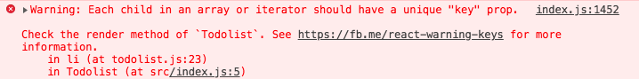
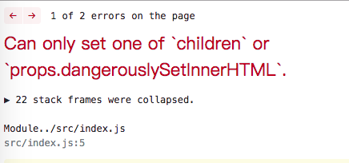
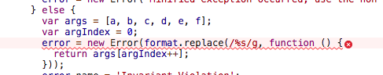
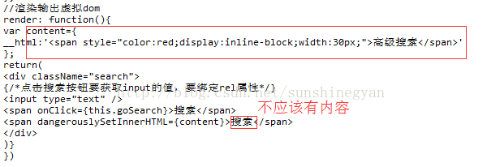
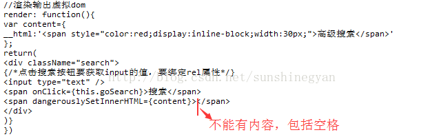
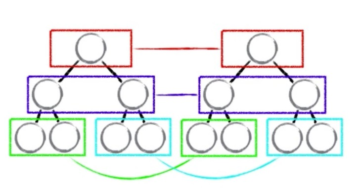
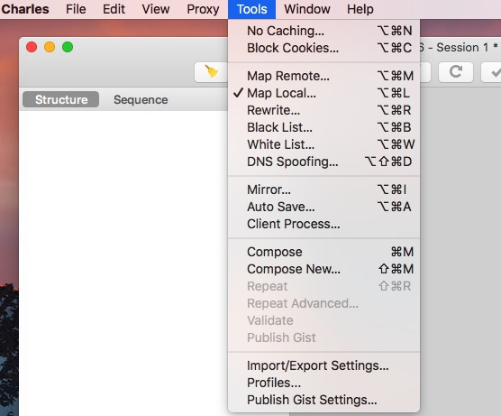
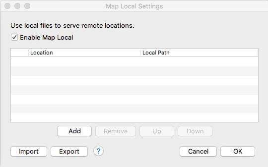
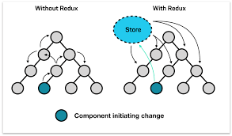
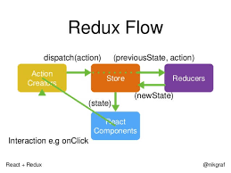

# Practice

## 实战总结

[react实战基础](./react.md)

## 遇到的一些坑

1. li里要带key值否则会警告，这个问题在vue中也存在, 考虑到虚拟DOM中diff，所以不要用index作为key值，而要用item。



2.immutable: state不允许我们做任何的改变，所以拷贝一份list，修改完再用setSate设置

```jsx
  removeClick(index) {
    // immutable
    // state不允许我们做任何的改变，所以拷贝一份list，修改完再用setSate设置，不建议用以下写法
    // this.state.list.splice(index, 1);
    // this.setState({
    //     list: this.state.list
    // })
    const list = [...this.state.list];
    list.splice(index, 1); 
    this.setState({
        list: list
    });
  }
```

3.Uncaught Error: Can only set one of `children` or `props.dangerouslySetInnerHTML`





解决方法

- 使用dangerouslySetInnerHTML属性的虚拟dom元素之间可能有内容，应该没有任何内容



- 改正



## 遇到之前不会的知识点

1.bind: 绑定this使得this指向组件todolist

```jsx
this.handleChange = this.handleChange.bind(this);
this.handClick = this.handClick.bind(this);

or

在事件后面直接绑定： {this.handleChange.bind(this)}
```

bind还可以把下标index传过去

```jsx
<button onClick={ this.removeClick.bind(this, index)
removeClick(index) {
const list = [...this.state.list];
list.splice(index, 1); 
this.setState({
    list: list
});
}
```

2.input里的值通过e传递。

```jsx
handleChange(e) {
//   console.log(this);
this.setState({
    inpputValue: e.target.value
})
}
```

3.angerouslySetInnerHTML: 为了防xss攻击

4.propTypes: 用于传值校验，避免传过来的值类型错误。

```jsx
import PropTypes from 'prop-types';
// 用于传值校验，避免传过来的值类型错误。
TodoItem.propTypes = {
  content: PropTypes.string,
  delete: PropTypes.func,
  index: PropTypes.number
}
```

假如把`content: PropTypes.string`改成`content: PropTypes.number`,则会警告，因为content是字符串类型，不是数字类型。

[](./images/propTypes.png)

5.defaultProps：用于设置isRequired的默认值

```jsx
// 用于设置isRequired的默认值
TodoItem.defaultProps = {
  test: 'Hello World'
}
```

6.props, state的每次改变都会引发render函数。

- props引发子组件的render函数；
- state引发父组件的render函数；

7.DOM操作的三个方案

第一种方案：

- 1.state数据
- 2.jsx模板
- 3.数据+模板结合，生成真实的DOM，来显示
- 4.state发生改变
- 5.数据+模板结合，生成真实的DOM，替换原始的DOM

缺陷： 

- 第一次生成一个完整的DOM片段
- 第二次生成一个完整的DOM片段
- 第二次的DOM替换第一次的DOM，非常耗性能

第二种方案：

- 1.state数据
- 2.jsx模板
- 3.数据+模板结合，生成真实的DOM，来显示
- 4.state发生改变
- 5.数据+模板结合直接生成真实的DOM，并不直接替代原始的DOM
- 6.新的DOM（DocumentFragment）和 原始的DOM作对比，找差异
- 7.找到input框发生的改变
- 8.只用新的DOM中的input元素，替代掉老的DOM中的input元素

缺陷： 性能的提升并不明显

第三种方案：

- 1.state数据
- 2.jsx模板
- 3.数据+模板结合，生成虚拟DOM（虚拟DOM是一个js对象，用了描述真实DOM）损耗了性能['div', {id: 'abc'}, ['span', {}, 'hello world']
- 4.用虚拟DOM的结构生成真实的DOM，来显示`<div id='abc'><span>hello world</span></div>`
- 5.state发生改变
- 6.生成新的虚拟DOM['div', {id: 'abc'}, ['span', {}, 'bye bye']]
- 7.比较原始虚拟DOM和新的虚拟DOM的叙别，找到区别的内容
- 8.直接操作DOM，改变span的内容。

优点：

- 1.性能提升了
- 2.它使得跨端应用得以实现。React Native

diff算法

- 1.setState使用异步函数是为了把多次setSate合并成一次，节约性能。


- 2.diff算法实际上是同层比对虚拟DOM的算法,只要对比一层不同，就删除下面的，用新的虚拟DOM替换，这样可以节约比对时间，节约性能。



- 3.循环列表中，li里要带key值否则会警告，这个问题在vue中也存在, 考虑到虚拟DOM中diff，所以不要用index作为key值，而要用item。

8.JSX原理

JSX->createElement->虚拟DOM（js对象）->真是的DOM

9.ref: 用来操作DOM，但不建议使用，一般在动画时要操作DOM才使用。

```jsx
<input id = "insertArea" ref={(input)=>{this.input=input}}/>
this.input.value==e.target.value;
```

注意在setState中使用时，因为setSate是异步的，直接写`console.log(this.ul.querySelectorAll('div').length);`
就会使得在setSta之前执行，所以要这样使用

```jsx
handleClick() {
    this.setState((prevState)=>({
        list: [...prevState.list, prevState.inputValue],
        inputValue: ''
    }), ()=>{
      console.log(this.ul.querySelectorAll('div').length);
    })
}
```

10.生命周期函数指在某一时刻组件会自动调用执行的s函数

- componentWillMount：组件即将被挂载到页面时被执行(在挂载时执行一次)
- render：props和state改变时被执行
- componentDidMount：组件载到页面之后，被执行(在挂载时执行一次)
- shouldComponentUpdate：组件被更新之前，他会自动被执行,要求返回一个布尔类型
- componentWillUpdate: 组件被更新之前，它会自动执行，但是他在shouldComponentUpdate之后执行，如果shouldComponentUpdate返回true它才执行，如果返回false，这个函数不会被执行
- componentDidUpdate: 更新后被执行，在render之后
- componentWillReceiveProps： 一个组件从父组件接受参数，只要父组件的render函数重新被执行了，子组件的这个生命周期函数就会被执行

11.react性能优化

- 1.在constructor用bind绑定this。
- 2.setState设计成异步的，虚拟DOM： diff同层比对算法（如果有一层不同就舍弃以下的层），列表key值。
- 3.子组件里shouldComponentUpdate返回false。
- 4.如果UI组件无逻辑处理，就可以用无状态组件

12.在react里使用ajax，用axios在componentDidMount里使用

13.利用Charles工具mock数据

- 1.创建todolist.json
- 2.使用Charles网络代理工具





- 3.mock

```jsx
axios.get('/api/todolist')
  .then((res)=>{
    this.setState(()=>({
      list: [...res.data]
    }))
  })
  .catch(()=>alert('error'))
```

14.css过渡动画和动画

- transition：过渡动画
- animation：动画

```css
.show {
    /* opacity: 1;
    transition: all 1s ease-in; */
    animation: show-item 2s ease-in forwards;
}
.hide {
    /* opacity: 0; */
    /* transition: all 1s ease-in; */
    animation: hide-item 2s ease-in forwards;
}
@keyframes show-item {
    0% {
        opacity: 0;
        color: deeppink;
    }

    50% {
        opacity: 0.5;
        color: pink;
    }

    100% {
        opacity: 1;
        color: purple;
    }
}

@keyframes hide-item {
    0% {
        opacity: 1;
        color: deeppink;
    }
    50% {
        opacity: 0.5;
        color: pink;
    }
    100% {
        opacity: 0;
        color: purple;
    }
}
```

- react-transition-group

15.redux
由于一些中大型项目中，组件之间的传值比较复杂，所以就要引入redux来管理数据状态。



redux原理



实现redux: 在store文件夹里实现store，然后在组件中使用，通过store.subscribe(this.handleStoreChange)订阅，通过store.dispatch(action)修改store

基础API

- createStore
- dispatch
- getState
- subscribe

三大原则：

- 单一数据源：整个应用的 state 被储存在一棵 object tree 中，并且这个 object tree 只存在于唯一一个 store 中。
- State 是只读的唯一改变 state 的方法就是触发 action，action 是一个用于描述已发生事件的普通对象， state只由store改变。
- 使用纯函数来执行修改为了描述 action 如何改变 state tree ，你需要编写 reducers。纯函数指的是给固定的输入久一点有固定的输出，而且不会有任何副作用，修改state的数据。

16.UI组件、容器组件、无状态组件

- UI组件：又称‘傻瓜组件’，一般只负责UI渲染，不负责逻辑处理
- 容器组件： 又称‘聪明组件’，负责逻辑处理
- 无状态组件： 组件只有render函数就可以用无状态组件，如果UI组件无逻辑处理，就可以用无状态组件

*无状态组件好处：提高性能，它只是一个函数，而写成类，有周期函数，渲染比较慢*